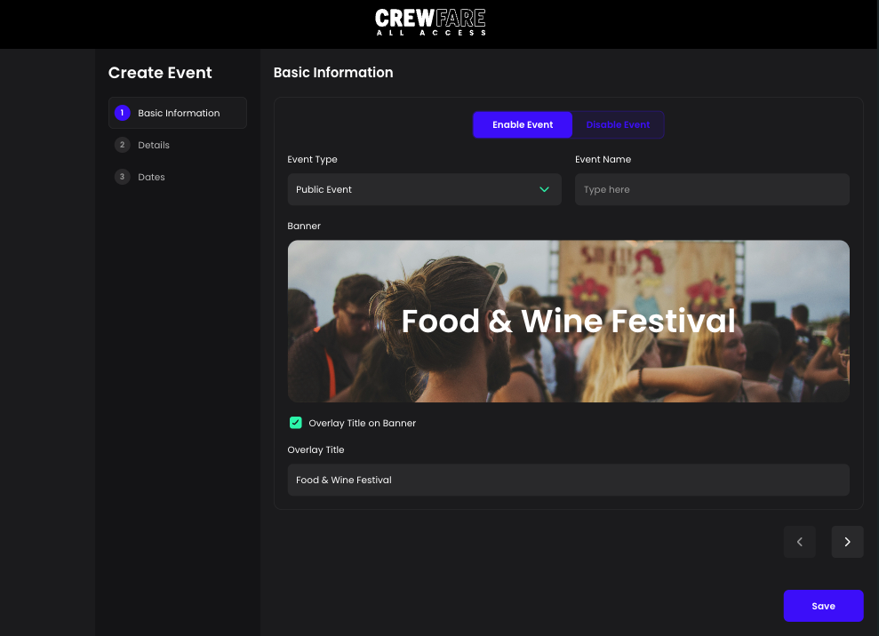
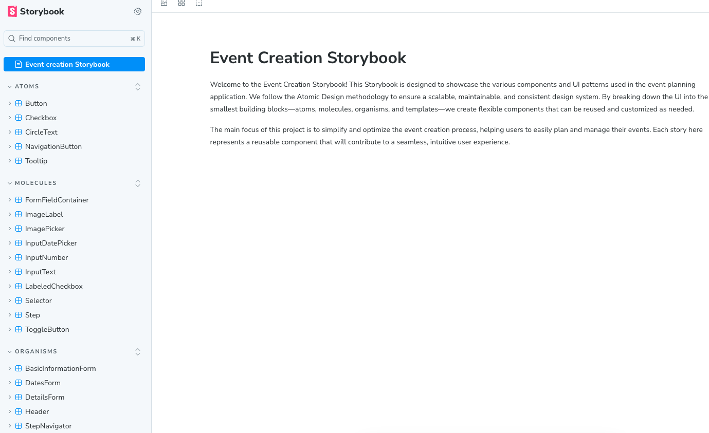
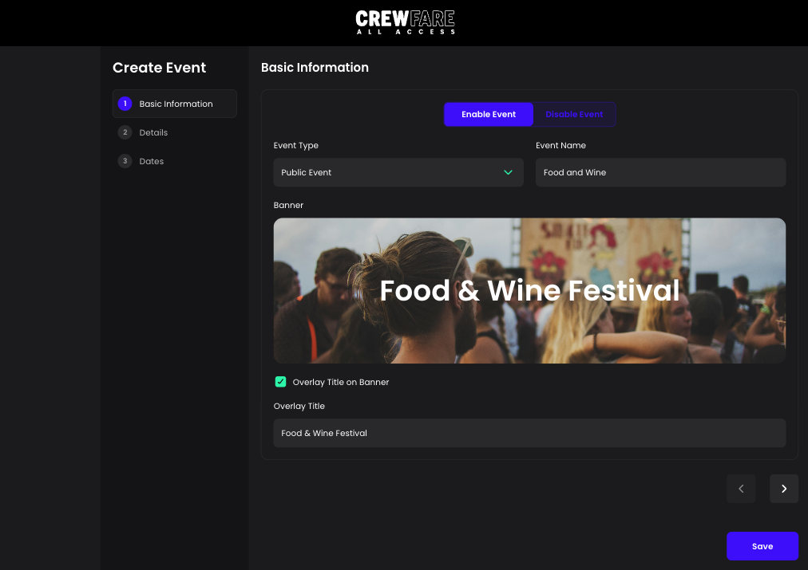
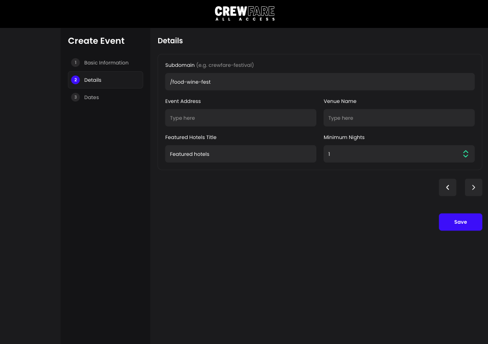
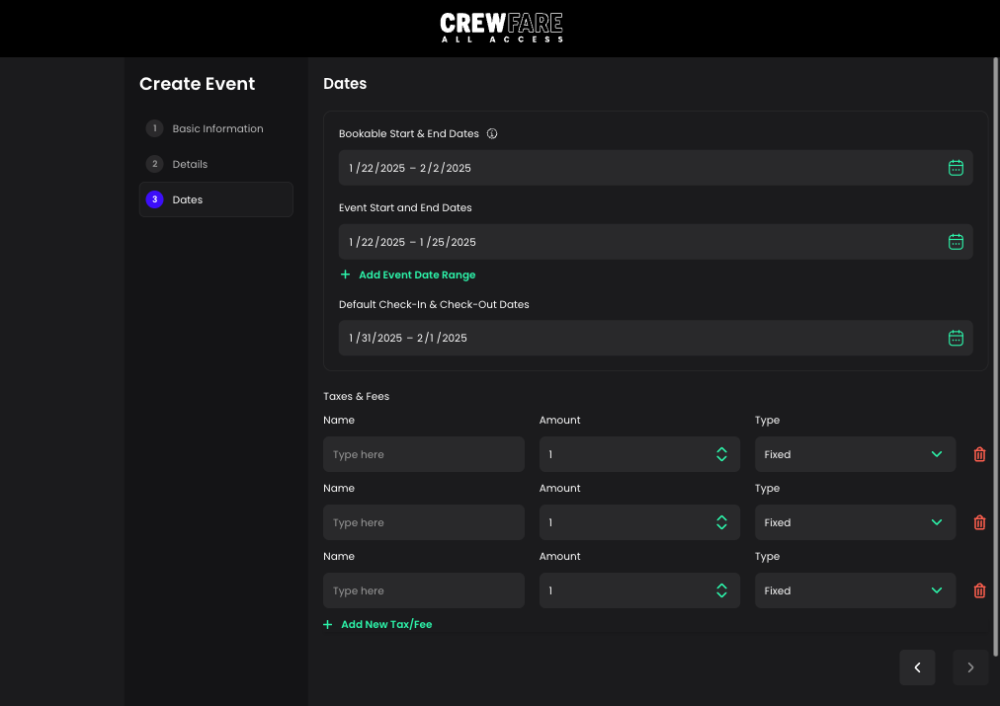
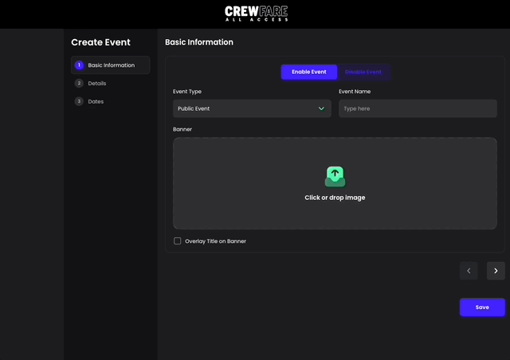
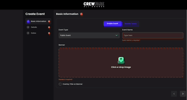
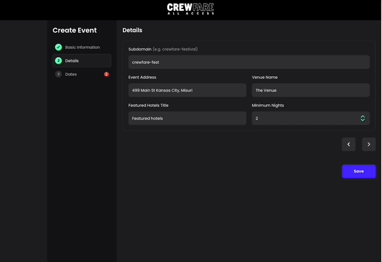
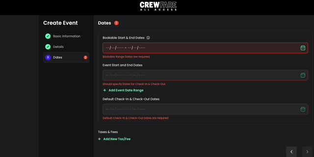
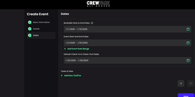

# Crewfare All Access (Event booker)

A Vite-powered application designed to optimize event management workflows. Developed using Vite, TypeScript, and TailwindCSS.

## Live Demo

You can explore the live demo here: https://create-event-ten.vercel.app/



## StoryBook

Component documentation is available through Storybook. View the component library here: https://create-event-storybook.vercel.app/



# Tech Stack

- TypeScript: For type safety and maintainable code.
- React: For building the UI components.
- Vite: For fast builds and development experience.
- TailwindCSS: For utility-first styling.
- Storybook: For component documentation and development.

## Other libraries

- Formik: For form handling and state management.
- Yup: For schema validation of form inputs.
- React Hot Toast: For displaying toast notifications.
- React Tooltip: For providing tooltips on UI elements.

# Instalation

1.- Clone the repo:

```shell
git clone https://github.com/ricardoaxel/create-event
cd create-event
```

2.- Install dependencies using npm:

```shell
npm install
```

## Running the Development Environment

To run the dev server:

```shell
npm run dev
```

## Creating a Production Build

To create a production build:

```shell
npm run build
```

## Running Storybook

To run Storybook for component documentation.

```shell
npm run storybook
```

# Screenshots and Functionality

## Basic information form



## Details form



## Dates form



## Form validation and button animation



## Drag and drop and revalidation when form it's completed



## Input number with keys or arrows



## Dates validations



## Scrollbar on overflow


